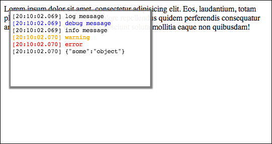

UiLogger
========

A `console` replacement for displaying log messages in the UI in addition to the native logging facility of the browser.

When the *UiLogger*'s JavaScript is loaded the native `console`-object gets replaced by a `UiLogger` proxy class that collects log messages and provides several API functions for displaying them directly in the UI. Nevertheless the log messages are forwarded to the native logging facility of the browser as well. Displaying logging messages directly in the UI is helpful when debugging on mobile devices where there is no remote debugging support like on iOS 6+.

### API

`UiLogger.LogLevel`  
A collection of log levels used by *UiLogger*.

`UiLogger.log(msg, level)`  
Log the given message with the specified log level (see `UiLogger.LogLevel`). If no log level is specified the default log level is used. If `msg` is not an instance of `String` the object gets serialized via `JSON.stringify()`. Invocations of the corresponding logging calls on the global `console`-object are redirected to the `UiLogger` as well.

`UiLogger.debug(msg)`  
`UiLogger.info(msg)`  
`UiLogger.warn(msg)`  
`UiLogger.error(msg)`  
Log the given message with the corresponding log level.

`UiLogger.showLogPanel()`  
Show the overlay panel and populate it with the collected log messages.

`UiLogger.hideLogPanel()`  
Hide the overlay panel displaying the log messages.

`UiLogger.isShowingLogPanel()`  
Returns `true`  if the overlay panel is being shown, `false` otherwise.

`UiLogger.clear()`  
Clears the internal buffer with collected log messages und empties the overlay panel as well.

`UiLogger.setMessageDecorator(decorator)`  
Inject a message decorator function that should return the `String` with the final log message from a given log entry. Each log entry is an object that contains the plain log message/object and the associated log level like

	{
		data  : "some log message",
		level : 2
	}
(codes for the log levels are available via `UiLogger.LogLevel`)

For example to wrap log messages in bars and append the numeric log level simply inject a message decorator like this:

	UiLogger.setMessageDecorator(
		function(logEntry) {
			return '|' + logEntry.data + '| [' +  logEntry.level + ']'
		}
	);

`UiLogger.getMessageDecorator()`  
Return the current message decorator function.
The default implementation converts the logging data into a `String` via `JSON.stringify` if it is not already an instance of `String` and prepends a timestamp.

### Usage

Just reference *UiLogger*'s default CSS and JavaScript in the HTML:

	<link rel="stylesheet" type="text/css" href="css/UiLogger.css">
	...
	

Afterwards start logging as you normaly do and call `UiLogger.showLogPanel()` to display the log messages in the UI:

	

The collected log messages will then be shown in an overlay panel like this:

